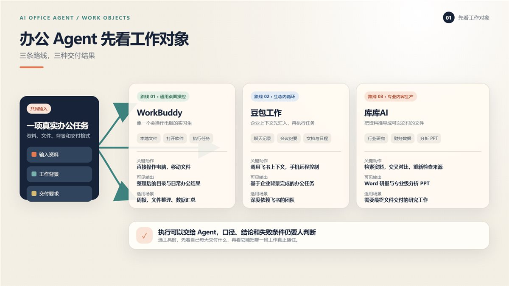
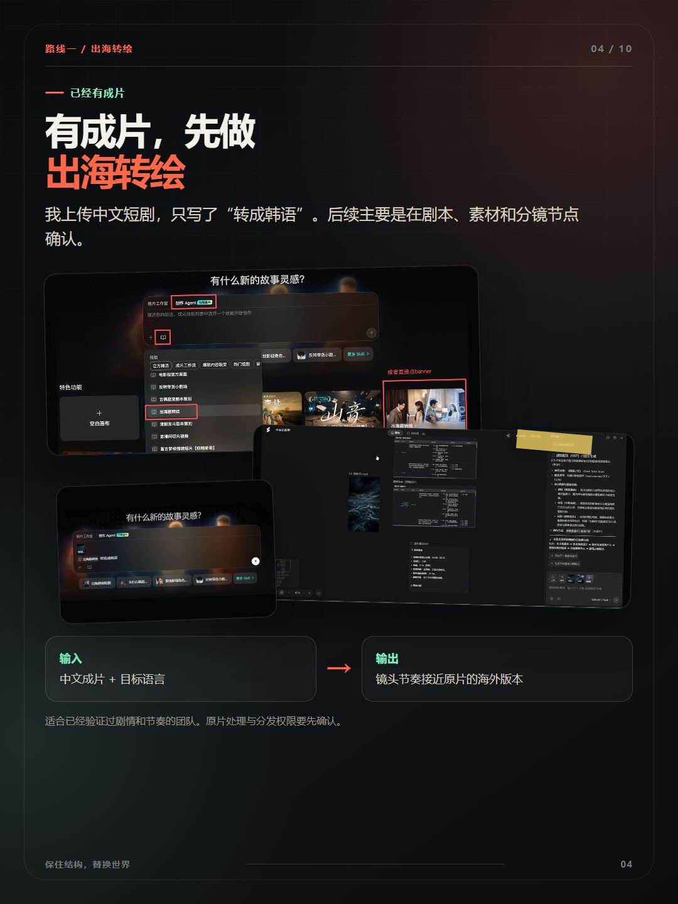
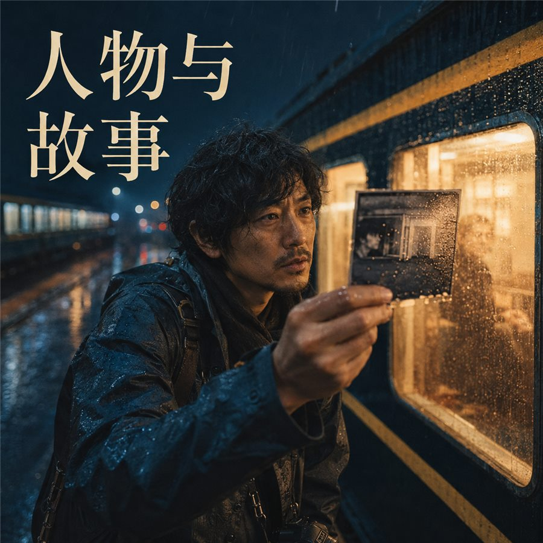

# 文章视觉导演

> 把文章里的核心主张、输入、动作、输出和边界，整理成可读、可检查、可交付的视觉资产。

`article-visual-director` 是一个 Codex Skill，支持公众号、X Article 和小红书的封面、正文配图、多页图文、概念海报，以及信息密集型小红书教程页面。

[](#封面结构图谱)

[查看 7 张封面案例](#封面结构图谱) · [浏览 7 种视觉风格](#视觉风格图谱)

## 安装

在 Windows PowerShell 中复制完整 Skill 目录：

```powershell
git clone https://github.com/zhouwei713/article-visual-director.git
Copy-Item -Recurse -LiteralPath ".\article-visual-director" -Destination "$env:USERPROFILE\.codex\skills\"
```

预期入口为 `%USERPROFILE%\.codex\skills\article-visual-director\SKILL.md`。安装后开启新任务，再使用 `$article-visual-director` 调用。

## 输出示例

用户输入：

```text
使用 $article-visual-director，把一篇关于 AI 写作 Skill 的文章做成小红书教程图文。
```

Skill 会先建立视觉简报和页面计划。没有特殊渲染要求时，文章封面优先使用 AI 生图；需要完整长标题、精确数据、严格截图还原或精确布局时，切换到 HTML 等确定性渲染。教程型小红书的信息密集内页继续使用 HTML，再统一输出：

```text
index.html
note.md
brief.md
plan.md
requirements.json
asset_manifest.json
assets/*
prompts/*
html/*.html
images/*.png
qa.md
```

## 它解决什么

常见问题与处理方式：

| 常见问题 | Skill 的处理方式 |
| --- | --- |
| 封面只剩一句口号 | 从文章主张、冲突、视觉锚点和标题层级重新组织画面 |
| 配图和文章内容脱节 | 映射具体输入、动作、输出、场景和边界 |
| 小红书卡片文字不稳定 | 教程内页先制作 HTML 或 React 页面，再由浏览器导出 PNG；封面根据视觉任务选择 AI 生图或 HTML |
| 教程截图和说明分离 | 建立素材清单，把截图证据与对应解释放在同一页 |
| 自述内容变成旁观转述 | 作者经历默认使用第一人称，并运行文案检查脚本 |
| 多页图文像重复模板 | 为每页设置独立阅读任务、证据和视觉关系 |
| 生成结果无法复核 | 保存需求契约、计划、源文件或提示词，并检查实际产物 |

## 封面渲染默认规则

没有特殊渲染要求时，公众号、X Article 和小红书封面优先使用 AI 生图。AI 适合表达人物动作、产品使用场景、概念隐喻、尺度冲突、强透视、空间纵深、拼贴、摄影和电影化光线。

完整长标题需要逐字准确，数字、表格、参数、流程、多级文字、真实截图标注、严格品牌版式或精确布局承担主要信息时，使用 HTML 或其他确定性渲染。无论采用哪条路线，都要在需求契约和页面计划中记录 `render_method`。

封面直接呈现中文时，优先提炼四至八个汉字的视觉短标题。AI 封面还要检查标题逐字准确、主体动作、前中后景、冲击机制、安全裁切和百分之二十五缩略图可读性。

## 案例图集

下面展示文章封面、正文配图、概念海报与小红书图文。横幅与概念海报按原主题重新设计，信息图和教程保留案例内容；点击图片可查看高清版本。

### 文章封面

公众号封面采用近景纸页与胶片转化，暖色放映光把标题、镜头序列和摄影轨道连在一起：

[](assets/examples/article-cover-wechat-seedance.png)

X Article 横幅重新安排胶片弧线与标题留白，在 5:2 画幅里保留连续的电影场景：

[](assets/examples/article-cover-x-seedance.png)

### 文章配图与概念海报

正文配图使用高清原图，将输入对象、三条工作路径和交付结果放在同一张图里；点击可查看细节：

[](assets/examples/article-illustration-ai-office.png)

概念海报用可拆装的巨型环与连续光线，表达模块接入后形成完整工作路径的关系：

[](assets/examples/concept-poster-deepseek.png)

### 小红书图文

小红书 AI 封面用巨字透视、人物与跨地域场景建立第一眼冲击。保留这张已选案例，以高清版本展示：

<p><a href="assets/examples/xiaohongshu-cover-seko.png"></a></p>

同一图文包的 HTML 教程内页保留原始操作截图和说明，独立展示，点击可看 1080×1440 原图：

<p><a href="assets/examples/xiaohongshu-inner-seko.png"></a></p>

封面负责主题识别，内页负责操作理解，两者共享深色底、暖色强调和明确标题层级。

## 视觉风格图谱

当前 Skill 内置 7 种主风格。下面用全新原创成图展示人物摄影、产品主体、概念纸艺、工作台、深色系统、触觉拼贴与文字海报的区别。每种风格都有独立的材质、光线与适用任务，点击图片可放大。

<table>
<tr>
<td width="50%"><a href="assets/examples/styles/human-story-editorial.png"></a><br><code>human-story-editorial</code><br>人物经历、文化观察和情绪观点。雨夜列车、旧照片和人物视线留下叙事悬念。</td>
<td width="50%"><a href="assets/examples/styles/product-hero.png"></a><br><code>product-hero</code><br>产品介绍和功能发布。原创红色装置成为主体，纸张输入与图像输出解释用途。</td>
</tr>
<tr>
<td width="50%"><a href="assets/examples/styles/concept-metaphor.png"></a><br><code>concept-metaphor</code><br>行业判断、抽象观点和趋势分析。平面红纸折成立体形状，让观点获得可见的形态。</td>
<td width="50%"><a href="assets/examples/styles/warm-workbench-map.png"></a><br><code>warm-workbench-map</code><br>教程、Skill、方法论和工作流。暖木桌面、折页与连接纸带把草稿、样张和成品串起来。</td>
</tr>
<tr>
<td width="50%"><a href="assets/examples/styles/dark-system-pulse.png"></a><br><code>dark-system-pulse</code><br>自动化、基础设施和系统状态。接点闭合、铜线脉冲与指示灯表现工作开始的瞬间。</td>
<td width="50%"><a href="assets/examples/styles/tactile-interface-collage.png"></a><br><code>tactile-interface-collage</code><br>内容生产、创意工具和社交传播。撕纸、照片、样张和夹子建立蓝红交错的触觉层次。</td>
</tr>
<tr>
<td width="50%"><a href="assets/examples/styles/high-concept-poster.png"></a><br><code>high-concept-poster</code><br>强观点、发布宣言和文字主导海报。荧光黄、黑色巨字与折起的边框共同表达突破限制。</td>
<td width="50%"></td>
</tr>
</table>

需要多个平台或多页图文时，封面先确定主风格，内页继承颜色、字体气质、材质和图形语言，同时根据每页的信息任务改变构图关系。

## 封面结构图谱

下面是专为本 Skill 制作的 7 张 AI 封面演示，围绕“文章如何变成视觉资产”展开。每张采用独立的场景、配色和阅读入口，点击图片可以查看大图。

### 单一主体 · 一篇文章，多种视觉

[](assets/examples/covers/single-hero.jpg)

`single-hero`：近景展开的纸页占据画面中心，用连续的纸张形态表现同一篇文章可以转成多种视觉资产。适合产品、作品和工具介绍。

### 动作瞬间 · 封面，差这一眼

[](assets/examples/covers/unfinished-moment.jpg)

`unfinished-moment`：人物抬起红色样张的瞬间，把视线、手部动作和透光纸张连在一起。适合创作经历、人物故事和经验复盘。

### 概念冲突 · 好内容，别埋没

[](assets/examples/covers/conceptual-tension.jpg)

`conceptual-tension`：一张红色封面从灰色纸堆中抽出，用颜色和尺度反差表达内容被看见的机会。适合观点、行业判断和抽象命题。

### 系统场景 · 把文章，做成图文

[](assets/examples/covers/system-landscape.jpg)

`system-landscape`：文字纸带经过微型纸艺印刷机，接续成图文页面。用一个场景暗示输入、转化和输出，适合教程、方法与工作流。

### 编辑型系统场景 · 文章视觉导演

[](assets/examples/covers/editorial-system-landscape.jpg)

`editorial-system-landscape`：大标题建立文章身份，长卷穿过巨型印框变成山水画面，远景人物强化尺度。适合复杂工具、项目介绍和系统能力拆解。

### 作品证据拼贴 · 封面，拿作品说话

[](assets/examples/covers/evidence-collage.jpg)

`evidence-collage`：将本组已生成的蓝色纸页封面和红色概念封面作为样张素材，重新生成实物拼贴场景。适合展示作品与交付成果；界面证据类封面另需使用原始截图。

### 标题与主体共享空间 · 让封面，抓住第一眼

[](assets/examples/covers/title-space.jpg)

`title-space`：荧光黄底色与黑色巨字建立第一视觉层级，一条胶片穿过文字留白。适合短标题、视觉宣言和强观点。

视觉风格决定颜色、材质与光线，封面结构决定第一眼的阅读入口。比如人物摄影可以使用动作瞬间，暖色纸艺可以使用系统场景，高概念海报可以使用概念冲突或标题主导的版式。

## 适用场景

支持以下平台和任务：

1. 公众号封面与正文配图
2. X Article 横幅与正文插图
3. 小红书封面和多页图文
4. 小红书教程型混合图文
5. 概念海报与参考图驱动的视觉方向
6. 提示词编写、契约校验和成图质量检查

## 工作模式

主要路由包括：

| 模式 | 交付 |
| --- | --- |
| `cover-only` | 单张封面与提示词 |
| `full-package` | 封面、正文配图、平台变体和检查结果 |
| `xiaohongshu-cover` | 小红书 3:4 封面 |
| `xiaohongshu-carousel` | 小红书多页图文与逐页资产 |
| `xiaohongshu-tutorial` | 无特殊要求时优先 AI 封面、HTML 或 React 教程内页与 3:4 PNG |
| `xiaohongshu-package` | 封面、多页图文、文案元数据和质量检查 |
| `prompt-only` | 可复制的完整提示词，不调用生图工具 |
| `revision` | 保留已选视觉方向，修改指定维度 |

## 小红书教程模式

`xiaohongshu-tutorial` 适合步骤、方法、工具拆解、框架说明和信息密集型知识卡片。

它默认使用混合路线：

1. 先拆解文章信息，确定每页的标题、输入、动作、输出和边界。
2. 用户没有指定风格时，只咨询一次，给出一个推荐封面方向和两个备选方向。
3. 封面无特殊渲染要求时优先使用 AI 生图，人物行动、产品场景、概念张力、强透视和质感海报尤其适合这条路线。
4. 长标题、精确数字、流程、截图标注和信息密集内页使用 HTML 或 React。
5. 使用 CSS、内嵌 SVG 和本地字体制作固定 1080×1440 内页，再通过浏览器导出准确 3:4 的 PNG。
6. 生成一个整体 `index.html`，集中展示文案、页面顺序、素材映射和导出状态。
7. 分别检查 AI 封面、HTML 页面、最终 PNG 和整体交付页的文字、裁切、溢出、层级和缩略图可读性。

AI 封面和 HTML 内页共享主色、字体气质、材质与图形语言。AI 封面可以只有提示词和最终 PNG，不要求存在同名 HTML。

资料带有截图、照片、图表或界面图片时，Skill 会建立 `asset_manifest.json`。截图与对应解释优先放在同一页，长截图可以使用完整总览加局部放大。标题、编号和标注放在独立 HTML 图层中，原始截图里的界面、文字和数据保持不变。

来源属于作者自己的经历、教程、测评或复盘时，图片说明和发布文案默认采用第一人称。第三方新闻、研究和引用资料继续保留必要归因。

## 使用

先提供文章文件、正文、标题与摘要，或文章加参考图，再说明目标平台、资产范围和比例。没有明确指定风格时，Skill 会根据内容提出三个封面方向并只咨询一次；没有特殊渲染要求时，封面优先 AI 生图，信息密集内页继续使用 HTML 或 React。

## 调用示例

文章封面：

```text
使用 $article-visual-director，为这篇文章生成一张公众号 2.35:1 封面。没有特殊排字要求，请优先使用 AI 生图，提炼一个四至八字的视觉短标题，保留文章的核心冲突和主体动作。
```

文章配图：

```text
使用 $article-visual-director 的 illustrations-only 模式，为这篇文章生成 3 张 16:9 正文配图。让每张图分别承担机制总览、关键对比和风险边界，保持同一套视觉基因。
```

小红书图文：

```text
使用 $article-visual-director 的 xiaohongshu-package 模式，把这篇文章做成 8 张 3:4 小红书图文。封面没有特殊要求，请优先 AI 生图；步骤、对比、数字和风险边界使用 HTML 精确排字，并输出独立 PNG、发布文案和整体预览页。
```

公众号完整视觉包：

```text
使用 $article-visual-director，为这篇文章生成公众号封面和正文配图，封面保留标题层级，正文图解释文章中的机制和边界。
```

小红书教程图文：

```text
使用 $article-visual-director 的 xiaohongshu-tutorial 模式，为这篇教程制作一张有冲击力的 AI 封面和一组信息丰富的 HTML 内页，再统一输出为 3:4 PNG。
```

带来源截图的小红书教程：

```text
使用 $article-visual-director 的 xiaohongshu-tutorial 模式处理这篇教程。保留资料中的原始截图，把截图和对应解释放在同一页；长截图使用完整总览加局部放大；发布文案与图片说明使用作者第一人称。
```

只要提示词：

```text
使用 $article-visual-director 的 prompt-only 模式，只输出封面和正文配图提示词，不生成图片。
```

更多可复现的路由、需求契约和预期结果见 [案例配方](references/examples.md)。完整图文包的最终版本选择格式见 [交付契约](references/delivery-contract.md)。

## 仓库结构

| 路径 | 用途 |
| --- | --- |
| `SKILL.md` | 入口说明、路由和核心工作流 |
| `agents/openai.yaml` | Codex 界面名称和默认调用词 |
| `references/` | 平台策略、风格库、页面结构和质量规则 |
| `assets/examples/` | README 使用的公开案例图 |
| `assets/examples/styles/` | 7 种主风格的公开示例图 |
| `assets/examples/covers/` | 7 种封面结构的 AI 成图案例 |
| `assets/examples/thumbs/` | README 使用的轻量预览图，点击后打开高清原图 |
| `scripts/validate_prompt_contract.py` | 校验图片提示词与需求契约 |
| `scripts/render_html_pages.ps1` | 等待字体和图片加载、检查溢出并将教程 HTML 渲染为 PNG |
| `scripts/check_xiaohongshu_copy.py` | 检查作者视角和公开图片中的内部制作说明 |
| `scripts/build_xiaohongshu_preview.py` | 生成包含文案、全部页面、素材映射和检查状态的整体交付页 |

## 设计理念

封面负责第一眼理解，正文页面负责补充关系、证据和行动路径。每一张图都要回答一个读者问题，并保留文章中可以核验的具体术语与边界。

## License

本项目使用 [MIT License](./LICENSE)。
